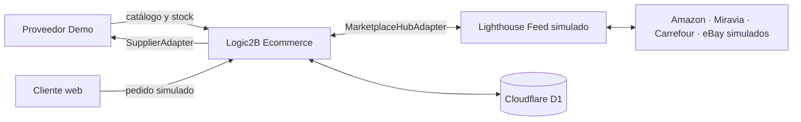

# Ecom Connect · FarmaHouse Demo

Demo funcional de parafarmacia omnicanal, derivada del motor **Logic2B Ecommerce**.
45 productos ficticios, carrito y checkout simulado, pedidos centralizados y
adaptadores intercambiables de proveedor y hub de marketplaces.

**Demo publicada:** [Tienda](https://ecom-connect.marinerandreu.workers.dev/) ·
[Panel omnicanal](https://ecom-connect.marinerandreu.workers.dev/admin) ·
[Feed XML](https://ecom-connect.marinerandreu.workers.dev/feeds/products.xml).

## Arranque

Requiere Node.js 22 o superior y pnpm.

```sh
pnpm install --frozen-lockfile
pnpm db:migrate
pnpm db:seed
pnpm dev
```

Tienda: `http://localhost:4327/`. Panel: `http://localhost:4327/admin`.
La semilla usa `INSERT OR IGNORE`: repetirla no borra pedidos ni sustituye cambios.

## Recorrido de presentación

1. Explorar la tienda, buscar «Champú», añadir a la cesta y completar una compra
   con el cliente ficticio precargado. No se solicita tarjeta ni se cobra.
2. Abrir **Panel → Pedidos**. El pedido aparece con canal **WEB**.
3. En **Marketplaces**, seleccionar Amazon, producto y cantidad; pulsar
   **Simular pedido**. Revisar el nuevo pedido con canal **AMAZON**.
4. En **Integraciones → Proveedor**, simular un stock de 7 y después sincronizar.
   La tienda y el feed muestran el disponible actualizado. Los pedidos aún no
   enviados al proveedor se descuentan del disponible, evitando reponerlos por error.
5. En un pedido, **Enviar al proveedor**. Se obtiene un ID `PED-ERP-*`.
   Avanzar por procesando, parcial/error si se desea, y enviado. Aparece `DEMO-*`.
6. En **Configuración**, alternar inmediato/agrupado. El botón para procesar
   pendientes ejecuta el lote; el programador automático queda preparado, pendiente de activación.
7. En **Lighthouse Feed**, regenerar y abrir el XML o JSON. Los cuatro canales
   muestran publicación simulada y la fecha real de la última operación.

## Arquitectura



[Análisis y reutilización](docs/ARQUITECTURA.md). El núcleo importado conserva
los snapshots de precios, ledger de inventario/pagos, cotización y escritura
transaccional de pedidos. La nueva migración 0045 añade metadata omnicanal.

## Endpoints

| Endpoint | Uso |
| --- | --- |
| `GET /api/products` | Catálogo activo |
| `POST /api/cart/quote` | Cotización en servidor |
| `POST /api/checkout/session` | Pedido/pago ficticio idempotente |
| `GET /api/demo/state` | Estado del panel |
| `GET /api/demo/orders/:id` | Pedido, líneas y eventos |
| `POST /api/demo/action` | Sync, stock, pedidos marketplace, envío y ajustes |
| `GET/POST /api/supplier/catalog` | Catálogo del proveedor simulado |
| `GET/POST /api/supplier/stock` | Stock del proveedor simulado |
| `GET/POST /api/supplier/orders` | Consulta/creación de pedido de proveedor |
| `POST /api/supplier/status` | Avanzar estado del proveedor |
| `GET /feeds/products.xml` | Feed conceptual Google Merchant |
| `GET /api/feeds/products.json` | Feed JSON |

Las mutaciones requieren los flags `DEMO_MODE=true`, `OMNICHANNEL_DEMO=true`,
JSON válido y cabecera `Origin` igual al origen del Worker. No hay credenciales
de pago, correo, proveedor ni marketplaces. Los adaptadores reales futuros deben
reemplazar los mocks y añadir autenticación, credenciales y validación operativa.

## Verificación

```sh
pnpm check
# Con pnpm dev activo, crean exclusivamente datos ficticios locales:
node scripts/smoke.mjs
node scripts/stock-race.mjs
```

El smoke comprueba importes, validación, mismo origen, idempotencia concurrente,
stock, los cinco canales, ambos modos de envío, estados, tracking y feeds.
La segunda prueba enfrenta dos compras contra una última unidad disponible.

## Cloudflare

Worker **ecom-connect** y D1 **ecom-connect-db**, separados del proyecto original.
La configuración real del recurso está en `wrangler.jsonc`; no contiene secretos.

```sh
pnpm exec wrangler login
pnpm exec wrangler d1 migrations apply ecom-connect-db --remote
pnpm exec wrangler d1 execute ecom-connect-db --remote --file seed/demo.sql
pnpm deploy
```

No requiere VPS, R2, KV ni servicios de pago. El consumo depende del tráfico y de
las cuotas de la cuenta Cloudflare. El panel es una demostración pública con
datos compartidos; no introducir datos personales reales. Todos los productos,
EAN, pagos, integraciones, promociones y expediciones son ficticios.

### Programación de pedidos agrupados

El 18/09/2026 Cloudflare rechazó el alta del cron con error 10072: esta cuenta
ya utiliza los 5 cron del plan Workers Free. El despliegue funciona con envío
inmediato o ejecución manual de pendientes. No se modificó ningún otro Worker
ni se contrató un plan. Cuando haya cuota disponible, añadir a wrangler.jsonc
`"triggers": { "crons": ["*/15 * * * *"] }`, cambiar
`GROUPED_CRON_ENABLED` a `"true"` y volver a desplegar. El handler scheduled
ya está implementado y el panel informa si la programación está activa.
