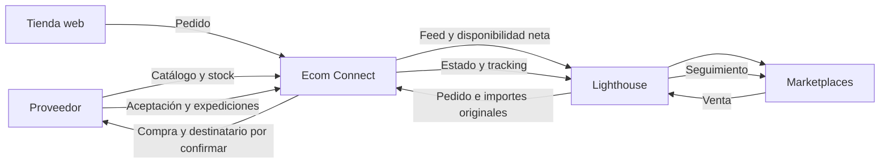

# Documentación técnica · Ecom Connect

Revisión: **19 de septiembre de 2026**. Ecom Connect es el intermediario que
coordina las ventas de la web y de los marketplaces con el proveedor que prepara
el pedido. Lighthouse distribuye el catálogo y conecta los canales. La aplicación
actual ejecuta este circuito con datos ficticios en su propia D1.

## Estado de la implementación

**La demo es funcional; la conexión comercial todavía no está habilitada.**
Revisar un contrato público no equivale a verificar una cuenta o una expedición.
No hay credenciales de proveedor o Lighthouse, cobros, emails ni pedidos reales.

| Capa | Disponible en el proyecto | Pendiente para operación real |
| --- | --- | --- |
| Tienda y núcleo | Catálogo, carrito, cotización servidor, pedidos y ledger | Condiciones comerciales y pasarela real fuera de esta demo. |
| Proveedor | Simulador D1; validación de su contrato documental sin tráfico | Base URL, sandbox, destino dropshipping, precios y garantías de reintento. |
| Lighthouse | Feed XML/JSON, publicación simulada y retorno de estado/tracking | OAuth, importación de ventas, acuses remotos y conciliación por canal. |
| Automatización | Envío inmediato y lotes manuales; handler scheduled | Activar un planificador con capacidad disponible y supervisión. |
| Operación | Eventos, estados y seguimiento demo | Autenticación, permisos, colas, alertas, cancelaciones y devoluciones. |
| Imágenes | Fotografías sintéticas para referencias ficticias y campañas | Fotografías fieles y autorizadas de cada producto real y su etiquetado. |

## Responsabilidades y recorrido



1. Importar catálogo y disponibilidad del proveedor. Separar coste, PVP e IVA;
   validar identidad y datos antes de publicar.
2. Calcular el stock publicable descontando compromisos pendientes. Publicar el
   feed y actualizar stock/precio en el hub con resultado por referencia.
3. Recibir la venta de Lighthouse conservando su ID, canal, dirección, líneas e
   importes de origen. Reservar una sola vez y verificar que se puede despachar.
4. Crear la compra al proveedor con una referencia estable. Persistir los pedidos
   ERP resultantes y resolver resultados ambiguos antes de repetir un alta.
5. Consultar cada línea y expedición. Notificar al hub solo el estado acreditado,
   con transportista y seguimiento. Conciliar errores sin repetir la venta.

## Decisiones del dominio

### Identificadores e idempotencia

No intercambiar SKU propio, código de artículo proveedor, GTIN, ID de Lighthouse,
referencia del marketplace y número ERP. El catálogo mantiene `sku`,
`supplier_sku` y `ean`. La conexión real necesita además correspondencias
durables por cuenta/canal y unicidad de pedido remoto.

La demo usa un UUID para identificar el intento de compra, un hash del contenido
y una sesión única en D1. Reintentar el mismo contenido no duplica la compra;
reutilizar la clave con otro contenido es un conflicto. El proveedor mock usa
la referencia del pedido y valida las líneas normalizadas.

El proveedor del PDF no documenta esa garantía: **no se puede trasladar la
idempotencia del mock a su API**. Ante un timeout del alta, consultar por
`pedidocliente`, usando el valor original de `referenciapedcli`, y retener el
pedido si el resultado sigue siendo ambiguo.

### Dinero, márgenes y fiscalidad de la integración

Los importes internos son enteros en céntimos. El precio del proveedor no es el
precio de venta hasta aclarar su significado, moneda, IVA y descuento. No se
debe restar un descuento con signo negativo sin confirmación documental.
El normalizador conserva los datos y rechaza importes con precisión ambigua.

Para la conexión real, conservar snapshots separados de coste, precio de venta,
impuestos, descuentos, portes y comisión. La venta del marketplace ya tiene
importes acordados: importarla no recalcula su precio con la tarifa web ni genera
otro cobro. El simulador actual sí usa la cotización web para fabricar una venta
ficticia; no constituye todavía un importador de ventas externas.

Lighthouse expresa `taxRate` como fracción (`0.21`); la demo almacena `vat` como
porcentaje entero (`21`). La conversión debe ser explícita y validada.

### Stock compartido

```text
disponible demo = max(0, stock proveedor − compras pagadas aún no comprometidas allí)
```

El backup no se suma automáticamente. Cada venta reserva una vez; la aceptación
del proveedor evita descontar dos veces la misma unidad en una sincronización.
La operación mock es transaccional y no admite stock negativo ni pedidos
parcialmente creados por falta de una línea.

`getcatstocktotal` solo devuelve referencias con stock positivo. Una referencia
ausente no debe conservar stock vendible indefinidamente ni ponerse a cero tras
una respuesta incompleta. Solo conciliar ceros a partir de una lectura completa
y válida o de la consulta explícita `getcatstock`.

La conexión real necesita margen de seguridad, antigüedad máxima del dato y
pausa de referencias con stock obsoleto. Un fallo de red no renueva la fecha de
la última lectura correcta.

### Estados y expediciones

Separar estado comercial, estado de producción del proveedor y notificación al
marketplace. En el PDF, `S` significa **producido**, no enviado. `numexp` no
documenta por sí solo transportista, URL de seguimiento ni prueba de entrega.

Una compra puede producir varios IDs ERP (el PDF muestra tres grupos, sin fijar
un máximo contractual) y devolver estados y cantidades
por línea. El diseño real necesita `supplier_purchase`, `supplier_order`,
`supplier_order_line`, `shipment` y `shipment_line` o relaciones equivalentes.
La demo mantiene un único pedido de proveedor por venta, pero ya registra varias
expediciones con cantidades por referencia, un seguimiento por paquete y su
acuse individual al hub. Sigue siendo una simulación local: no reproduce los
varios IDs ERP por compra ni debe confundirse con la API externa.

El retorno mock a Lighthouse conserva el estado canónico del pedido en
`marketplace_order_updates`. Se puede comprobar en el detalle del pedido y
conciliar al sincronizar. Este acuse local no acredita recepción por Lighthouse.

## Persistencia y operación antes de activar adaptadores reales

| Registro propuesto | Finalidad |
| --- | --- |
| Correspondencias de productos y canales | SKU propio ↔ código proveedor ↔ gID/IDs de oferta. |
| Pedido externo y sus líneas | Cuenta, canal, ID remoto único, moneda e importes originales. |
| Compras y líneas del proveedor | Relación uno-a-varios con pedidos ERP y cantidades aceptadas. |
| Expediciones y líneas | Cantidades enviadas, transportista, número y evidencias. |
| Inbox de integración | Evento o venta recibida, clave única, hash y resultado de procesamiento. |
| Outbox de integración | Intención durable, intentos, próxima ejecución, error y confirmación. |
| Cursores de sincronización | Ventana/página completada, bloqueo de ejecución y fecha de éxito. |
| Incidencias | SKU desconocido, diferencia de importe, destino inválido y respuesta ambigua. |

Estas tablas describen el diseño objetivo; no se presentan como migraciones ya
implementadas. El núcleo dispone de primitivas de outbox y jobs que deben
componerse con los adaptadores reales y probarse antes de activarlas.

Los reintentos deben tener espera creciente, límite y bandeja de incidencias.
Un fallo al notificar tracking no revierte el envío físico. Reconciliar pedidos
remotos y locales de forma periódica y conservar los acuses por operación.

## Seguridad y configuración

- Las mutaciones demo exigen `DEMO_MODE=true` y `OMNICHANNEL_DEMO=true`; el control
  de origen y rate limit no sustituyen login y autorización administrativa.
- Guardar credenciales futuras solo en secretos del Worker, nunca en el
  navegador, repositorio, seed o logs. No reutilizar recursos de `logic-ecom`.
- OAuth y webhooks deben verificarse en servidor. La firma de Lighthouse usa
  cuerpo original y ticks .NET; no validar una serialización reconstruida.
- Separar eventos deduplicados, notificaciones confirmadas e incidencias.
  No registrar direcciones, tokens ni payloads personales completos en logs.
- Usar destinos ficticios en pruebas. La demo no es el entorno para introducir
  información personal o activar pagos, emails o expediciones.

## Bloqueos concretos y criterio de salida

| Prioridad | Pendiente | Evidencia necesaria |
| --- | --- | --- |
| P0 | Destino dropshipping ausente del alta del proveedor | Contrato confirmado de dirección, destinatario y servicio de entrega. |
| P0 | Base URL, autenticación y entorno de pruebas proveedor | Sandbox y ejemplos anonimizados de éxito/error. |
| P0 | Precios/IVA/descuento ambiguos | Definición de coste, moneda, impuestos, signo y redondeo. |
| P0 | Resultado incierto y varios pedidos ERP | Política de consulta/reintento y prueba de no duplicación. |
| P0 | Envío real y transportistas | Mapa de estados, expediciones por línea y transportista reconocido. |
| P0 | Cuenta Lighthouse y canales | Credenciales sandbox, feed validado e importación de pedidos multilínea. |
| P1 | Cancelaciones, devoluciones y reembolsos | Responsables, contratos operativos, plazos y pruebas por canal. |
| P1 | Automatización y observabilidad | Planificador activo, colas, conciliación y alertas verificadas. |
| P1 | Acceso administrativo y datos de producto | Roles, autenticación y atributos/fotografías exigidos por canal. |

No activar el circuito comercial hasta superar un recorrido sandbox completo:
feed → venta multilínea → reserva → compra → expedición → tracking → acuse,
incluyendo duplicados, última unidad concurrente, timeout tras aceptación,
fallo del hub y reconciliación posterior.

## Documentos de referencia

- [Contrato del proveedor y discrepancias](PROVEEDOR.md).
- [Lighthouse: fuentes oficiales y operaciones](LIGHTHOUSE.md).
- [API local de demostración](API.md).
- [Procedencia y arquitectura del núcleo](ARQUITECTURA.md).
- [Verificación y recorridos](VERIFICACION.md).
- [Imágenes generadas y trazabilidad](IMAGENES.md).

Las fuentes externas se tratan como documentación del contrato; sus ejemplos no
autorizan ejecutar operaciones comerciales ni introducir credenciales reales.
