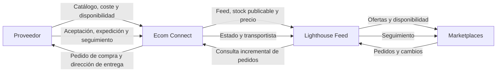

# Lighthouse Feed: contrato y preparación de la integración

Revisión de fuentes oficiales: **19 de septiembre de 2026**. Alcance: desarrollo
propio de Ecom Connect como intermediario de dropshipping. Este documento recoge
el contrato público y las decisiones de arquitectura propuestas; no acredita una
conexión comercial ni una prueba con credenciales. La aplicación sigue siendo una
demo con proveedor, hub y marketplaces simulados.

## Papel de cada sistema

Ecom Connect debe ser dueño de la correspondencia de identificadores, las
reservas, el pedido al proveedor, los márgenes y la conciliación. Lighthouse es
el conector de canales. El proveedor prepara y expide al destinatario cuando su
contrato lo permita. Que una oferta esté publicada o un pedido importado no
demuestra que el proveedor lo haya aceptado.

## Lo que confirma la documentación pública

### Alta, autenticación y feed

La integración para desarrollos propios se configura en el CMS de Lighthouse.
Publica OAuth2 Client Credentials: `POST https://app.lighthousefeed.com/connect/token`,
formulario con `grant_type=client_credentials`, `client_id` y `client_secret`.
Las llamadas usan `Authorization: Bearer`; renovar según `expires_in` y gestionar
`401`. Conviene fijar `api-version=1.0`. El catálogo base llega mediante un feed
compatible con Google Merchant que Lighthouse recoge periódicamente. La guía
también propone consultas periódicas para recibir pedidos. Ofrece un entorno de
pruebas en `https://lighthousefeeddev.azurewebsites.net`, con cuenta solicitada al
equipo de Lighthouse. El registro antiguo de ventas con `initTrackOrder` está
marcado como obsoleto; remite a `CmsSales`.
[Fuente: desarrollos a medida y ERPs](https://lighthousefeed.com/docs/desarrollos-propios/).

### Operaciones verificadas

Rutas relativas a `https://app.lighthousefeed.com`, con prefijo `/api/CustomDevs/`:

| Método | Recurso | Uso |
| --- | --- | --- |
| POST | `Products/ExtraInfo` | Stock, precio, coste, impuesto e IDs; hasta 1.000 productos. |
| POST | `Products/Overrides/Shipping` | Sobrescribir portes. |
| GET | `Platforms` | Identificar canales activos. |
| POST | `Platforms/{platformRef}/Products/ExtraInfo` | Límites de precio por canal. |
| GET | `Sales` | Pedidos; `page`, `pageSize` máximo 200, `updateDate`, `platformOnly`. |
| POST | `CmsSales` | Alta/actualización de ventas web por `cmsOrderID`. |
| POST | `UpdateCmsSales` | Estado/seguimiento de venta existente por `lighthouseId`. |
| GET/POST | `Carriers` | Consultar/sincronizar transportistas. |

Detalles críticos: `CustomDevProduct.stock` omitido equivale a cero; `taxRate`
expresa proporción (`0.21`), no porcentaje entero. `CustomDevUpdatedSale` admite
`cmsOrderID`, `status`, `shippingNumber`, `cmsCarrierID`. Los estados incluyen
`Unknown`, `Cancelled`, `Created`, `Handling`, `Sent`, `Delivered`,
`PendingPayment`, `WaitingAcceptance`, `Refunded`.
No hay operaciones explícitas de RMA o reembolso financiero en esta especificación.
[Fuente: OpenAPI público 1.0](https://app.lighthousefeed.com/api/help/versions/1.0/document.json).

La [referencia navegable](https://app.lighthousefeed.com/api/help/index.html)
permite consultar los modelos completos. Los nombres anteriores son externos;
las rutas `/api/demo/*` y `/api/supplier/*` de este proyecto son APIs locales de
demostración.

### Webhooks

Se reciben mediante POST JSON, con `ID`, `EventType`, `UtcDateTime` y `Value`;
`eventType` también aparece en la query. La cabecera `LighthouseFeed-Signature`
lleva `t` y `s`: HMAC-SHA256 del texto `t + "." + cuerpo original`, usando el
secreto del webhook. La firma se representa en hexadecimal con separadores. `t`
son ticks .NET desde el año 1, no milisegundos Unix. La guía documenta `Test`
con respuesta `204` y `PriceChanges` con `204` o resultados individuales en
`200`. Advierte de reenvíos y recomienda procesamiento en segundo plano.
`FillOrderEvent` aparece mencionado sin un contrato operativo completo: no basta
para implementar recepción de pedidos por webhook.
[Fuente: eventos y autenticación](https://lighthousefeed.com/docs/eventos-de-lighthouse-feed-webhooks/).

### Configuración específica de canales

- **Amazon:** la guía exige cuenta de vendedor, autorización, región y
  configuración logística. Permite activar sincronización de pedidos y exportar
  seguimiento. Si falta la ficha del producto, describe su creación en Seller
  Central; una publicación de feed no garantiza un alta completa.
  [Guía Amazon](https://lighthousefeed.com/docs/enviar-feed-productos-amazon/).
- **Miravia:** requiere cuenta de vendedor y datos de fabricante/responsable.
  Documenta creación de fichas exportables y actualización de precio/stock;
  modificaciones estructurales posteriores se realizan en Seller Center.
  [Guía Miravia](https://lighthousefeed.com/docs/conectate-con-miravia/).
- **Datos de producto:** los requisitos de marketplace superan el feed básico,
  incluyendo stock y preparación del envío.
  [Guía de importación](https://lighthousefeed.com/docs/importar/).
- **Imágenes:** Lighthouse distingue las imágenes comerciales de las imágenes
  GPSR y pide fotografías fieles del producto o envase para estas últimas. Los
  packs e imágenes hero generados con IA para esta demo no sustituyen fotos
  reales de etiquetado, fabricante, ingredientes o advertencias.
  [Guía de imágenes GPSR](https://lighthousefeed.com/docs/datos-gpsr-productos/).

La interfaz de pedidos del servicio contempla incidencias de sincronización y
corrección/reexportación. Nuestra operativa necesita una bandeja equivalente para
evitar que un fallo quede oculto tras un contador de pedidos importados.
[Gestión centralizada de pedidos](https://lighthousefeed.com/docs/gestion-de-pedidos-lighthouse-feed/).

## Matriz de cobertura del proyecto

La columna «contrato» se apoya en las fuentes anteriores. La columna «proyecto»
procede de revisar los adaptadores y la composición locales. Las tareas indicadas
son requisitos de Ecom Connect, no prestaciones atribuidas al proveedor.

| Área | Contrato externo | Proyecto revisado | Requisito antes de conexión real |
| --- | --- | --- | --- |
| Autenticación | Confirmado | El mock no autentica contra terceros | Cliente servidor, secretos aislados, renovación y caducidad. |
| Feed base | Confirmado | XML con ID/SKU, título, URL, imagen, precio, disponibilidad, marca y GTIN | Validar atributos por categoría/canal; completar imágenes adicionales y logística. |
| Stock/precio | Confirmado | Publicación registra cantidades en D1 | Enviar disponibilidad neta, procesar errores por SKU y verificar recepción. |
| Identidad | Confirmado | SKU propio separado del código proveedor | Mantener relaciones durables entre variante, SKU, gID, canal y proveedor. |
| Pedidos | Consulta confirmada | `incomingOrder` fabrica una línea y un cliente ficticio | Importador multilínea, importes de origen, moneda, dirección y estado de pago. |
| Duplicados | Requisito propio | UUID de la simulación evita repetir altas locales | Unicidad por cuenta/canal/referencia remota y por ID Lighthouse. |
| Seguimiento | Actualización confirmada | Retorno mock persistido en D1 y conciliación de acuses | Cola de salida remota, transportistas y acuse real de Lighthouse. |
| Estados | Enumeración confirmada | Estados comerciales y del proveedor separados | Añadir estado remoto y mapa validado por canal; preservar historial. |
| Webhooks | Firma y eventos parciales confirmados | Sin receptor externo | Verificador de firma, antirreplay, inbox durable y tipos permitidos. |
| Cancelación | Estado existente; operación efectiva pendiente | Sin recorrido completo | Confirmar quién detiene la preparación y libera la reserva. |
| Devolución/reembolso | Contrato operativo pendiente | Sin recorrido completo | RMA, recepción, coste, aprobación y reembolso en el canal correspondiente. |
| Expediciones parciales | Pendiente de concretar | `partial` solo representa un estado | Identidad de expedición y cantidades por línea; confirmar soporte remoto. |
| Automatización | Polling posible | Lotes manuales; cron preparado y desactivado | Planificador operativo, bloqueo de solapamiento y monitorización. |

Archivos analizados: [`MarketplaceHubAdapter`](../src/integrations/marketplace-hub-adapter.ts),
[`MockLighthouseAdapter`](../src/integrations/mock-lighthouse-adapter.ts),
[`SupplierAdapter`](../src/integrations/supplier-adapter.ts),
[`composición demo`](../src/lib/demo.ts), [`API local`](API.md) y
[`arquitectura`](ARQUITECTURA.md). Esta matriz es una revisión del punto de partida;
los cambios de esta entrega añaden retorno mock y normalización de contrato.

## Preparación de payloads implementada

`src/integrations/lighthouse-api-contract.ts` ofrece un constructor puro de
`Products/ExtraInfo`, probado sin credenciales ni tráfico externo. Recibe `gId`,
`stock` obligatorio, identificadores CMS opcionales, importes en céntimos y
`vatPercent`; produce los nombres y unidades del modelo `CustomDevProduct`.
Limita el lote a 1–1.000 entradas, rechaza IDs repetidos y cantidades fuera del
rango int32, convierte `21` a `0.21` y comprueba que la serialización de precios
conserva los céntimos. Los opcionales ausentes no se mandan para evitar borrar
valores remotos. Es preparación de contrato; no constituye un cliente conectado.

## Diseño propuesto del circuito dropshipping

### 1. Publicar disponibilidad que se pueda cumplir

El SKU propio es la identidad estable del feed; un cambio de nombre o URL no debe
crear otra referencia. Guardar el SKU del proveedor como correspondencia, no como
identidad del pedido del canal. Separar coste de adquisición, PVP y margen por
canal. Calcular dinero en céntimos y convertir a decimal únicamente en el borde
del adaptador; convertir impuestos explícitamente y rechazar valores inválidos.

Aplicar una política de reserva única para todos los canales. La disponibilidad
publicable debe descontar compromisos aún no reflejados por el proveedor y un
margen de seguridad configurable. Un fallo de sincronización no debe renovar
artificialmente la frescura del stock. Definir cuánto tiempo puede publicarse
stock antiguo antes de pausar las referencias afectadas.

No sumar automáticamente el almacén de respaldo: requiere confirmar que comparte
precio, plazo y servicio dropshipping. Registrar resultados por SKU y separar
«enviado a Lighthouse» de «aceptado por el canal».

### 2. Importar y aceptar pedidos sin alterar la venta original

Guardar un cursor de sincronización solo después de persistir todas las páginas
de una ventana. Volver a consultar un pequeño solapamiento temporal y deduplicar
en D1; eso permite recuperar modificaciones con la misma fecha. Un proceso debe
poseer cada cursor para que dos ejecuciones no se adelanten mutuamente.

Conservar el identificador de Lighthouse, la referencia original, la cuenta, el
canal, la fecha remota, la moneda y los importes originales de cada línea. Usar
una restricción única en base de datos, no únicamente una comprobación previa.
El importe pactado en un marketplace no debe sustituirse por el precio actual
de la tienda. Reconciliar cantidades, descuentos, envío e impuestos en servidor;
las discrepancias pasan a revisión sin cobrar otra vez al cliente.

Separar recepción, aceptación comercial, pago informado por el canal y envío al
proveedor. No tratar un pedido pendiente de pago o de aceptación como preparado
para expedición. Rechazar SKU desconocido y dirección incompleta de forma
recuperable; conservar una incidencia rastreable sin inventar datos del cliente.

### 3. Despachar al proveedor y cerrar el circuito

Persistir la intención de compra antes del envío. Reutilizar una referencia
estable en reintentos. Ante un timeout ambiguo, consultar por esa referencia
antes de repetir una creación; un timeout no demuestra que el proveedor no haya
aceptado. Guardar su respuesta y confirmar por separado cuándo ha comprometido
stock.

Traducir el seguimiento a un transportista reconocido. Una expedición real crea
un trabajo de salida hacia Lighthouse; una confirmación satisfactoria cierra ese
trabajo. Si el hub falla, conservar el envío físico como realizado y reintentar
solo la notificación. En parcial, conservar cantidades expedidas y pendientes
por línea sin declarar enviado el pedido entero prematuramente.

Usar colas durables de entrada/salida con intento, próxima ejecución, último
error y fecha de confirmación. Reintentos con espera creciente y variación
aleatoria; tratar autenticación, validación y caídas temporales de forma distinta.
Añadir conciliación periódica para recuperar pérdidas o estados discordantes.

### 4. Asegurar las entradas y hacer visibles las incidencias

El futuro receptor externo necesita autenticación propia: las guardas `Origin`
de la API demo no autentican a Lighthouse. Verificar bytes originales con
Web Crypto, comparación segura y ventana temporal configurable; convertir ticks
con `BigInt` para no perder precisión. Registrar el identificador del evento
atómicamente antes de responder. Rechazar firmas incorrectas y tipos desconocidos.

La bandeja operativa debe mostrar antigüedad del stock, pedidos retenidos, errores
de SKU, reintentos y tracking pendiente de confirmar. Los registros técnicos deben
omitir tokens, secretos y datos personales completos. En esta demo todo el tráfico
y los destinatarios siguen siendo ficticios y las mutaciones requieren ambos
flags de demostración.

## Pendientes que deben resolverse con Lighthouse y el proveedor

1. Cuenta de pruebas y canales efectivamente contratados; límites de frecuencia,
   timeouts, política de reintentos y retención de eventos.
2. Confirmación del estado exacto que permite aceptar/despachar por cada canal;
   permisos y efecto de actualizar un pedido del marketplace desde el CMS.
3. Moneda, composición de totales, precisión y tratamiento de descuentos e IVA
   en muestras de pedidos reales anonimizadas.
4. Webhook de nuevos pedidos si existe para la cuenta, su esquema y su garantía
   de entrega. Mantener polling como mecanismo verificable mientras tanto.
5. Cancelación efectiva, RMA, reembolso parcial, sustituciones y expediciones
   múltiples: responsable, operaciones disponibles y tiempos de respuesta.
6. Transportistas admitidos, etiquetas, plazo de preparación, países y datos
   mínimos que el proveedor exige para entregar directamente al cliente.
7. Acuse por oferta/canal y prueba de correspondencia de gID. Resolver atributos
   de producto y fotografías reales requeridas antes de publicar catálogo real.

Estos pendientes no impiden desarrollar simulaciones y pruebas de contrato. Sí
impiden afirmar que el circuito comercial completo está operativo.

## Criterios de aceptación para el adaptador futuro

- Un pedido multilínea importado dos veces produce un pedido interno y una
  compra al proveedor; modificaciones posteriores actualizan su estado.
- Una venta conserva su importe original aunque el catálogo cambie después.
- La última unidad vendida simultáneamente no genera stock local negativo y
  cualquier rechazo externo queda retenido para resolución.
- Un timeout después de aceptación no duplica la compra al proveedor.
- Un envío persiste aunque Lighthouse esté caído y su seguimiento se transmite
  tras recuperar la conexión.
- Firma inválida, cuerpo alterado, fecha fuera de ventana y evento repetido
  tienen pruebas específicas; duplicar el evento no repite efectos.
- Una cancelación o devolución solo libera stock y cambia estados tras la
  evidencia correspondiente; un cambio de etiqueta no simula un reembolso.
- El recorrido sandbox valida feed, importación, proveedor, tracking y
  conciliación con datos ficticios antes de cualquier activación real.
